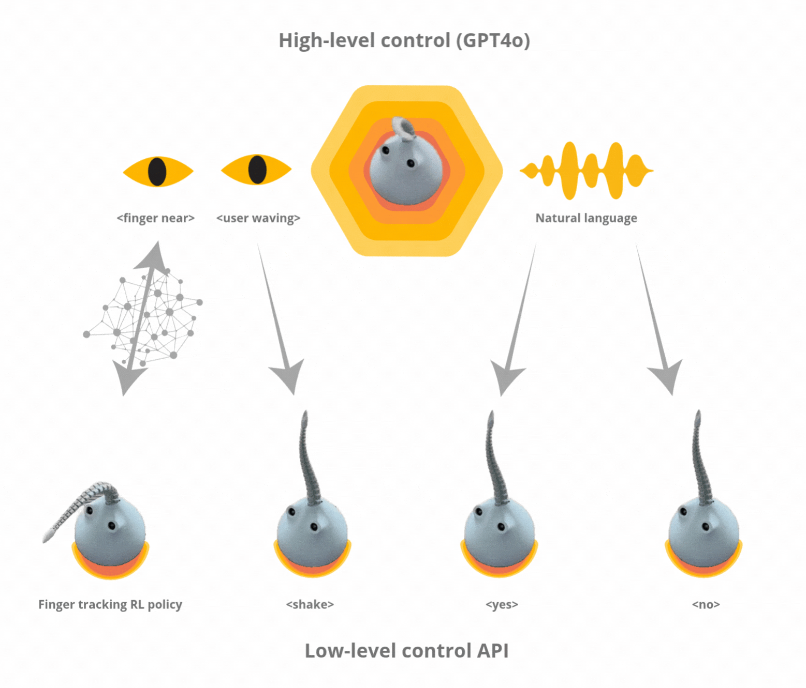

# Rex Tendon


Rex Tendon is a soft-bodied tentacle robot using the [SpiRobs](https://arxiv.org/pdf/2303.09861) design, controlled through a mix of reinforcement learning and GPT-4o. Read the full blogpost [here](https://www.matthieulc.com/posts/rex-tendon/).

## Quick Start

### 1. Installation

First, ensure you have Python 3.10+ and [Poetry](https://python-poetry.org/docs/#installation) installed.

Clone the project repository and install the dependencies:
```bash
git clone https://github.com/DeepSoul-173/Rex_Tendon
cd rex-tendon
poetry install
```

Next, `lerobot` is a key dependency that needs to be installed from source:
```bash
git clone https://github.com/huggingface/lerobot.git
pip install -e ./lerobot
```

Finally, activate the virtual environment to run the subsequent commands:
```bash
eval "$(poetry env activate)"
```

### 2. Hardware Configuration

Find the USB port for the driver board using a script from `lerobot`:
```bash
python lerobot/scripts/find_motors_bus_port.py
```

Once you have the port, configure each motor (for IDs 1, 2, and 3), replacing `DRIVER_BOARD_USB_PORT` with the port you found:
```bash
python lerobot/scripts/configure_motor.py \
  --port DRIVER_BOARD_USB_PORT \
  --brand feetech \
  --model sts3215 \
  --baudrate 1000000 \
  --ID 1
```

### 3. Motor Calibration

Calibrate the motors by adjusting with the arrow keys until the tentacle tip is straight, then press Enter to save:
```bash
python -m rex_tendon calibrate --config rex_tendon/configs/default_hardware.yaml
```

### 4. Run the Orchestrator

Run the main orchestrator application, which integrates all system components:
```bash
python -m rex_tendon orchestrate \
  --config rex_tendon/configs/default_orchestrator.yaml \
  --hardware-config rex_tendon/configs/default_hardware.yaml \
  --perception-config rex_tendon/configs/default_perception.yaml \
  --control-config rex_tendon/configs/default_control.yaml
```

## Hardware Replication

For a full replication and setup of the robot, follow the steps in [ASSEMBLY.md](ASSEMBLY.md). All 3D printing assets are included in the repository. The total should cost less than 200$.

## Software Replication

### 1. Hardware Setup

Test motor connections:
```bash
python -m rex_tendon primitive "<yes>" --config rex_tendon/configs/default_hardware.yaml
```

Calibrate motors:
```bash
python -m rex_tendon calibrate --config rex_tendon/configs/default_hardware.yaml
```

### 2. Manual Control

Control with trackpad:
```bash
python -m rex_tendon trackpad --config rex_tendon/configs/default_hardware.yaml
```

Test idle motion with breathing pattern:
```bash
python -m rex_tendon idle --duration 10 \
  --hardware-config rex_tendon/configs/default_hardware.yaml \
  --control-config rex_tendon/configs/default_control.yaml
```

### 3. RL Pipeline

Generate MuJoCo XML model:
```bash
python -m rex_tendon generate-xml --output-path rex_assets/rex_simulation/tentacle.xml
```

Train RL model:
```bash
python -m rex_tendon rl train --config rex_tendon/configs/default_rl_training.yaml
```

Monitor with Tensorboard:
```bash
tensorboard --logdir=./
```

Evaluate RL model in simulation:
```bash
mjpython -m rex_tendon rl evaluate ./rex_results/ppo_tentacle_XXXXXXX/rex_models/best_model.zip --config rex_tendon/configs/default_rl_training.yaml --num-episodes 10 --render
```

### 4. Vision Pipeline

Record calibration images for stereo triangulation. Tune the pause interval to have time to change the pattern orientation:
```bash
python -m rex_tendon record stereo-calibration --num-pairs 20 --interval 3
```

Calculate the stereo triangulation calibration parameters using the images you just recorded by following the steps in the DeepLabCut notebook under `notebooks/3d_triangulation.ipynb`.

Record annotation videos. This command will record 6 pairs (one for each camera) of 10 second videos:
```bash
python -m rex_tendon record annotation --duration 60 --chunk-duration 10
```

Extract representative frames using k-means:
```bash
python -m rex_tendon extract-frames video.mp4 output_frames/ 100
```

I used [roboflow](https://roboflow.com/) to annotate these images, it has a great auto-label feature to avoid wasting time on high confidence images.


Then change `base_model` in the vision training config to point to the best model checkpoint and continue training on real images.

Evaluate trained model:
```bash
python -m rex_tendon vision evaluate model.pt dataset.yaml --config rex_tendon/configs/default_vision_training.yaml
```

Infer on single image:
```bash
python -m rex_tendon vision predict model.pt image.jpg --output prediction.jpg --confidence 0.5 --config rex_tendon/configs/default_vision_training.yaml
```

Debug stereo vision and triangulation:
```bash
python -m rex_tendon debug-perception --config rex_tendon/configs/default_perception.yaml
```

### 5. Full System

Run the closed loop RL model and vision model on the real robot:
```bash
python -m rex_tendon.control.closed_loop \
  --control-config rex_tendon/configs/default_control.yaml \
  --perception-config rex_tendon/configs/default_perception.yaml \
  --hardware-config rex_tendon/configs/default_hardware.yaml
```

Run the full orchestrator:
```bash
python -m rex_tendon orchestrate \
  --config rex_tendon/configs/default_orchestrator.yaml \
  --hardware-config rex_tendon/configs/default_hardware.yaml \
  --perception-config rex_tendon/configs/default_perception.yaml \
  --control-config rex_tendon/configs/default_control.yaml
```

## Known Issues

- Control can sometimes cause the motors to go into infinite rolling/unrolling for unknown reasons. What works for me in the situation is to reset by unrolling the cables to their maximum, and re-rolling them back. This sometimes requires opening up the robot to untangle wires. I haven't found the time to fix this, if you do, please open a PR!
- `orchestrator/orchestrator.py`, `control/closed_loop.py` and `control/idle.py` were heavily vibe-coded and have only been lightly refactored.
- Inference using `control/closed_loop.py` leads to a tracking offset on the Y axis as compared to simulation.

## Possible Extensions

- Increase robustness of GPT4o layer or train from scratch (e.g. [Moshi-like](https://kyutai.org/rex_assets/pdfs/Moshi.pdf))
- Give it a voice (but as non-human as possible!)
- Train more RL policies (e.g. grabbing and holding complex objects)
- Use direct drive motors to reduce noise
- Add more tentacles and make it crawl
- Ditch the 2D projection control to unlock more expressive policies